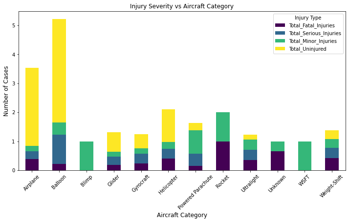
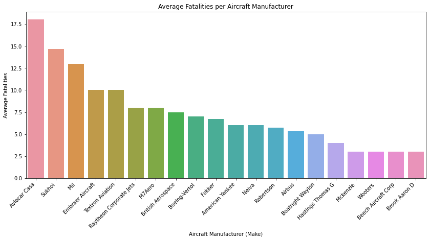
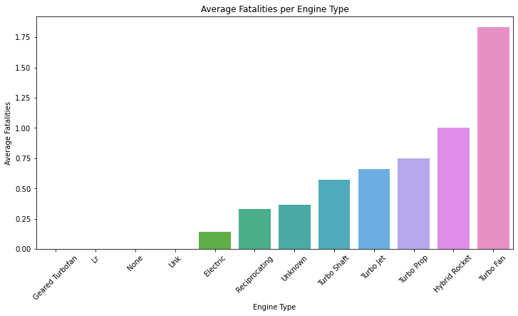

## Airplane Purchase Risk Assessment

**Author**: [Florence Joy Aran](mailto:florence.aran@student.moringaschool.com)

### Project Overview
The objective of this analysis is to evaluate and determine low-risk aircrafts to be purchased by our company, Mawingu Group of Companies as we gear towards expanding our portfolio and breaking into the aviation industry.We aim to opeate airplanes for commercial and private enterprises hence we need to determine the potential risks of aircrafts.

This project analyzes aviation accident data from the National Transport Safety Board, covering civil aviation accidents and selected incidents that occured in the United States and international waters from 1962 to 2023.By extensive data analysis of this dataset, we aim to identify aircrafts with impeccable safety records.

The major focus areas for this analysis will be on quantifiable metrics like aircraft damage, total fatalities in accidents while comparing them to aircraft categories, make and engine types. Ultimately, Mawingu group of companies aims to build a foundation for long-term success in the aviation industry by prioritizing the safety of its crew and customers.

### Business Problem
Inorder for Mawingu Group of Companies to expand its portfolio into the aviation industry, we have to understand the risks associated with purchasing and operating airplanes for both commercial and private enterprises. Choosing aricraft models know to be safe is not only important for our customers' safety but also for the business's finances and reputation. 

Assessing historical aviation accident data offers a valuable opportunity to identify key trends, patterns and risk factors linked to different airplane models. This data driven approach will enable us to make informed decisions, as we will prioritize aircraft models with proven track records of safety and avoid those with recurring safety issues.

### Data Understanding

The goal is to explore the National Transportation Safety Board data and identify key features that we can use to assess the risks associated with various aircrafts. 

### Data Cleaning

After exploring the data, I need to clean the data to make it easier to work with. There are columns and rows that might not be useful for our analysis and we are better of dropping them.

### Data Visualizations

We will graphically analyze key variables and their relationships to identify risk factors, patterns and trends across the dataset. The desired outcome of this is to deduce clear and actionable insights for Mawingu Group's aviation business decisions.

### Conclusions

Penetrating into the aviation industry necessitates selecting the right aircarfts that guarantee reliability, operational efficiency and safety. Through this analysis, we have established trends that provide critical insights into how different manufacturers, aircraft types and engine configurations contribute to accident occurances and overall safety. 

One of the key findings is that the type of aircraft and its safety measures are very vital. Inasmuch as most of the aircraft categories were involved in accidents, it is important to note the number of uninjured people was significantly higher in some aircrafts than fatalities. 

Using the event date time, we are able to see total fatalities over the years. We are able to see years that had the least fatalities and do further analysus to understand what safety features were implemented in those years to mitigate accident occurrences.

Lastly, by analysing total fatalities against engine types, we are able to identify engine types deemed to be safer and have less fatalities than others. 

### Recommendations

Based on the analysis, here are my recommendations:
1. Prioritize aircrafts and manufacturers with proven safety records - having analysed the injury severity for different aircrafts, identifying and investing on aircrafts that have higher survival rates and lower fatality rates would ensure safety of the aircraft and the passengers.
2. Ensure aircraft engine safety - inorder to enhance opertaional safety, we need to prioritize engines that have lower fatality rates. We should also ensure regular maintenance activities are conducted to minimize accident risks and ensure they perform at optimum efficiency.
3. Invest in aircrafts with strong structural integrity and minimal damage history - prioritizing aircraft models that have demonstrated less damage in accidents compared to others is key because with strong structural integrity, the severity of injuries is reduced.
